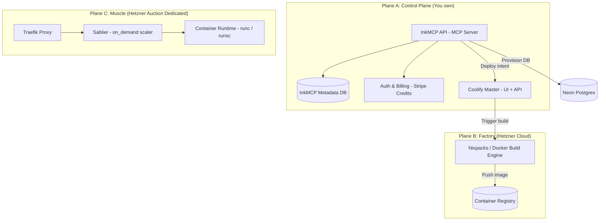

# Deploy MCP

> **One MCP to deploy them all.** Infrastructure for the agentic era.

The below documentation is preliminary plan and goals.

---

## Motivation

AI agents can now write complete applications. Claude Code, Cursor, and Windsurf generate production-ready code in minutes. But when it's time to deploy, agents hit a wall:

**The Fragmentation Problem:**

- Need Railway MCP for hosting
- Need Neon MCP for database
- Need separate tools for secrets, DNS, SSL
- Manual wiring of connection strings
- Human must create accounts on each platform

**The Result:** Agents build in seconds, but deploying takes hours of human intervention.

```
# Today
Agent: "I've created your SaaS app. Here's the code."
Human: *creates Railway account*
Human: *creates Neon account*
Human: *deploys app manually*
Human: *provisions database*
Human: *copies connection string*
Human: *sets environment variables*
Human: *configures domain*
Human: *waits for SSL*
→ 2 hours later: "It's live"

# With Deploy MCP
Agent: deploy(repo="github.com/user/my-saas", database={type:"postgres"})
→ 60 seconds later: "https://my-saas.deploy.app is live"
```

---

## Vision

**"Internet for Agents"** — Infrastructure that agents can provision autonomously.

Deploy MCP is a **platform**, not just a tool:

- Users authenticate to **us**
- We provision infrastructure using **our** provider credentials
- Agents deploy with **one command**
- Users never touch provider dashboards

---

## Core Principles

| Principle                | Description                                        |
| ------------------------ | -------------------------------------------------- |
| **Repo as Identity**     | `github.com/user/app` is the natural project key   |
| **One Transaction**      | App + database + secrets + domain in a single call |
| **Auto-Deploy Default**  | Push to GitHub → automatic deployment              |
| **Platform Abstraction** | Users never see underlying providers               |
| **Right Tool for Job**   | Frontend → edge, Backend → containers              |

---

## Authentication

Users authenticate to Deploy MCP. We handle all provider credentials internally.

### Flow

```
1. User visits deploy-mcp.dev
2. "Sign in with GitHub" → OAuth
3. We store: user identity + GitHub token (for private repos)
4. Dashboard shows API key: dk_live_abc123...
5. User adds to MCP config
6. All MCP calls authenticated via API key
7. We use OUR provider credentials behind the scenes
```

### Why GitHub OAuth?

- **Repo is the project key** — Need GitHub identity anyway
- **Private repo access** — OAuth token lets us clone user's repos
- **Verify ownership** — Confirm user owns repo before deploying
- **Familiar** — Every developer has GitHub

---

## Tech Stack

- **Language**: Go
- **MCP Framework**: mcp-go
- **Database**: Postgres
- **Auth**: GitHub OAuth + JWT

## Adding Local MCP Server to Claude Code

```bash
claude mcp add --transport http mcpdeploy http://localhost:8081/mcp --header "Authorization: Bearer <your-api-key>"
```

---

# InkMCP: The Agent Deployment OS

**Mission:** Build the "AWS for AI Agents." A unified Model Context Protocol (MCP) server that allows autonomous agents to provision infrastructure, deploy full‑stack applications, and host **persistent WebSocket games** on bare metal without human intervention.

InkMCP starts with **Coolify + Hetzner** (fast to ship), but the agent-facing contract is **provider-agnostic** so we can migrate the compute plane to **Kubernetes** later without breaking clients.

---

## Core Philosophy

1. **Abstraction**

   - Agents interact with **Projects** and **Modes** (intent), not "servers" or "containers" (implementation).
   - The MCP surface is stable; providers are replaceable.

2. **Safety**

   - We run untrusted code with strong guardrails.
   - Target state: **gVisor** sandboxes for user workloads (defense against kernel exploit classes).
   - Reality check: gVisor integration with Coolify requires deliberate engineering (see Security notes).

3. **Economics**
   - Sleeping apps (`on_demand`) subsidize always-on (`persistent`) workloads.
   - Credits/spend caps prevent agent retry loops from burning money.

---

## What InkMCP Deploys

InkMCP exposes **service types** and **runtime modes**.

### Service Types (what it is)

- `webapp_static` — static site (SPA/docs/landing), served via a tiny web server container
- `webapp` — HTTP web service (SSR, API routes, typical request/response)
- `backend` — APIs, realtime servers (WebSockets), workers, cron jobs

### Runtime Modes (how it lives)

- `static` — minimal resources, effectively always-on but cheap
- `on_demand` — sleeps after idle; wakes on request (cold start acceptable)
- `persistent` — always-on, reserved resources (WebSockets, workers, long-running jobs)

> Note: `backend` covers HTTP servers, workers, and cron. The difference is expressed via the **start command** (and optional schedule), not separate types.

---

## Physical Architecture (3-plane)

We separate control, build, and run so CPU-heavy builds never lag a live game.

### Topology



### What runs where (explicit)

**Plane A — Control Plane**

- InkMCP API
- InkMCP metadata DB (projects/resources/usage/audit)
- Auth + billing + credits ledger
- Scheduler / placement logic (when multiple run nodes exist)

**Plane B — Factory**

- Coolify "master" instance (UI + API) orchestrating deployments via SSH to other servers
  Coolify uses **SSH** for deployments and management. ([Coolify][1])
- Build engine (Nixpacks / Dockerfile / Compose build packs) ([Coolify][2])
- Container registry (shared image store; required once you have multiple run servers/build servers) ([Coolify][3])

**Plane C — Muscle**

- Docker engine + proxy on each run server
- User containers (apps, backends, workers)
- On-demand scaling middleware (Sablier) for `on_demand` services
- Optional sandbox runtime (`runsc` / gVisor target)

> Coolify design note: each server runs its **own proxy**, and app traffic goes directly to the server hosting that app (not through the main Coolify server). DNS must point to the correct server. ([Coolify][4])

---

## Runtime Modes: Technical Behavior

### `static`

- Build output served by a lightweight web server container
- Very low CPU/RAM
- Best for docs, SPAs, landing pages

### `on_demand`

- Requests hit **Traefik → Sablier**
- Service sleeps after idle window
- Wakes on request (cold start ~seconds)
- Best for "mostly idle" Next.js SSR, admin panels, internal tools

### `persistent`

- Always-on container (reserved RAM/CPU)
- No sleeping
- Best for WebSocket games, chat, bots, workers, realtime APIs

---

## MCP Interface (The Agent Contract)

### Principles

- Name-based (agents forget IDs)
- Discoverable (`list_*`, `get_*`)
- Idempotent (`ensure_*`)
- Logs are first-class (agents must self-debug)

### Tool Sketch (v1)

- `ensure_project(name)`
- `list_projects()`
- `deploy_app(project_name, service_name, repo_url, mode, build_command?, start_command?, resources?, env_vars?)`
- `update_env_vars(project_name, env_vars)`
- `get_logs(project_name, scope=build|runtime, service_name?, tail?)`
- `provision_database(project_name, tier)`
- `get_database_credentials(project_name)`

> Multi-service repos: call `deploy_app` multiple times with different `service_name`s (e.g. `web`, `api`, `worker`).

---

## Multi-Process / Monorepo Support

Real repos frequently contain more than one runnable process:

- `cmd/server` (HTTP)
- `cmd/worker` (background)
- plus sometimes a `web/` frontend

InkMCP supports this via **service targets**:

- `service_name = "web"` (mode `on_demand`) — Next.js SSR
- `service_name = "worker"` (mode `persistent`) — queue consumer
- `service_name = "game"` (mode `persistent`) — WebSocket server

### How InkMCP knows what to run

InkMCP needs explicit runtime intent:

- `build_command` (optional)
- `start_command` (required unless auto-detected safely)
- `port` (required for HTTP/WS servers)

Recommended: support a repo manifest (e.g. `inkmcp.yaml`) that defines service targets. InkMCP can generate this too, but the goal is deterministic behavior.

---

## Databases

### SQlite (initial)

Turso - Managed SQLite, later migrate.

### Primary (initial)

InkMCP provisions Postgres via Neon and returns a connection string.

### Short-term alternatives (keep provider interface stable)

- **Bring-your-own connection string** (fast escape hatch)
- **Self-hosted Postgres via Coolify** (works, but operationally heavier)
- Optional later:
  - Supabase (managed Postgres + extras)
  - Upstash (Redis/KV) for caching/queues

---

## Container Registry & Artifact Storage

Once you have:

- multiple run servers, and/or
- a dedicated build server

…you need a shared registry so run servers can pull the built images. Coolify's build server flow explicitly assumes images are pushed to a registry. ([Coolify][3])

### Recommended approach

- Use a registry with durable storage (local NVMe + backups, or object-storage-backed registry).
- Avoid relying on flaky network mounts for hot-path registry storage.

> Note: "Storage Box mounted via CIFS" can work for backups/archives, but CIFS mounts are commonly reported as brittle for container hot paths (stale mounts, permissions, disconnects). Treat it as **backup storage**, not a live registry datastore.

### Registry via Coolify API

When deploying via API, specify the registry image directly:

```json
{
  "docker_registry_image_name": "ghcr.io/user/app:latest"
}
```

Coolify can pull from any registry configured in its settings (Docker Hub, GHCR, custom registries).

---

## Ops Manual

### Connecting Auction (Dedicated) servers to Cloud (Factory) via vSwitch

Dedicated auction servers and cloud servers sit on different networks. Hetzner supports bridging them using a Robot vSwitch connected to a Cloud Network subnet. ([Hetzner Docs][5])

High-level steps:

1. In Hetzner Cloud Console: create a Network (e.g. `ink-vpc`, `10.0.0.0/16`)
2. Add a subnet and enable "Dedicated server vSwitch connection" (select your Robot vSwitch) ([Hetzner Docs][5])
3. In Robot: create/configure vSwitch and attach dedicated servers ([Hetzner Docs][6])
4. On the dedicated server OS: configure VLAN/Netplan for that vSwitch VLAN, assign a private IP
5. In Coolify: add the server via its private IP as a deployment destination

### Adding multiple Hetzner machines to Coolify

- Coolify manages remote servers via SSH ([Coolify][1])
- Each run server hosts its own proxy and serves traffic directly ([Coolify][4])
- InkMCP must implement placement logic (which server to deploy to)

DNS strategy (simplest):

- `*.s1.apps.example.com` → run server #1
- `*.s2.apps.example.com` → run server #2
  InkMCP returns the correct hostname base depending on placement.

---

## Backups & Restore

### What we back up (by category)

1. **InkMCP State (critical)**

   - metadata DB (projects/resources/usage/audit)
   - credits ledger + billing webhook state
   - encryption keys/secrets

2. **Coolify State (critical)**

   - Coolify configuration + metadata
   - Use Coolify's S3-compatible backup feature ([Coolify][7])

3. **User Data (critical)**

   - Databases: provider-native backups (Neon), and/or scheduled dumps
   - Persistent volumes: only if explicitly supported; define policy

4. **Images (important but rebuildable)**
   - images should be treated as cache/artifacts, not the source of truth

### Restore procedure (disaster recovery)

**Scenario: Factory (Coolify master) lost**

1. Provision a fresh Factory server
2. Install Coolify
3. Restore from S3 backup (Coolify supports backup/restore workflows) ([Coolify][7])
4. Reconnect run servers (if not automatically restored)
5. Validate proxies/DNS

**Downtime reality check**

- Existing apps on run servers can continue serving traffic because each run server has its own proxy and traffic does not depend on the master. ([Coolify][4])
- You _do_ lose management/deploy capability until restore.

---

## Security Configuration

### Coolify Native Resource Limits

Coolify supports container resource limits via API:

| Setting               | Coolify Field               | Example                           |
| --------------------- | --------------------------- | --------------------------------- |
| Memory limit          | `limits_memory`             | `512m`                            |
| Memory + swap         | `limits_memory_swap`        | `512m`                            |
| CPU limit             | `limits_cpus`               | `0.5`                             |
| CPU pinning           | `limits_cpuset`             | `0,1`                             |
| Custom Docker options | `custom_docker_run_options` | `--cap-drop=ALL --pids-limit=256` |

### Host-Level Hardening

See `infra/hetzner/hardening/` for complete setup scripts including:

- Egress restrictions (iptables rules for metadata service, SMTP)
- gVisor integration (`runsc` runtime)
- Least-privilege container policies

---

## Coolify API Integration

InkMCP deploys applications via Coolify's REST API.

### Authentication

All API requests require a Bearer token (Laravel Sanctum):

```
Authorization: Bearer <coolify-api-token>
```

### Key Endpoints

| Endpoint                           | Method | Purpose                     |
| ---------------------------------- | ------ | --------------------------- |
| `/api/v1/applications/dockerimage` | POST   | Deploy from Docker image    |
| `/api/v1/applications/public`      | POST   | Deploy from public Git repo |
| `/api/v1/applications/{uuid}`      | PATCH  | Update application settings |
| `/api/v1/deploy`                   | POST   | Trigger deployment          |

### Deploying an Application

```bash
curl -X POST https://coolify.example.com/api/v1/applications/dockerimage \
  -H "Authorization: Bearer $COOLIFY_TOKEN" \
  -H "Content-Type: application/json" \
  -d '{
    "project_uuid": "abc123",
    "server_uuid": "def456",
    "environment_name": "production",
    "docker_registry_image_name": "ghcr.io/user/app:latest",
    "ports_exposes": "3000",
    "limits_memory": "512m",
    "limits_cpus": "0.5",
    "custom_docker_run_options": "--cap-drop=ALL --pids-limit=256 --runtime=runsc",
    "instant_deploy": true
  }'
```

### Persistent Storage

Coolify supports two volume types:

- **LocalPersistentVolume** - Docker named volume or host path bind mount
- **LocalFileVolume** - Embed file content (for configs)

For disk-backed user storage:

```json
{
  "name": "user-data",
  "mount_path": "/data",
  "host_path": "/mnt/persistent/{project-id}"
}
```

Host path volumes require cleanup when project is deleted (Coolify handles named volumes automatically).

---

## Non-goals (for sanity)

- Replacing GitHub (we'll integrate)
- Building a full PaaS UI for users (InkMCP is the product; Coolify is backend)
- Solving arbitrary sandboxing perfectly on day 1 (ship baseline + iterate)

---

## Design Notes

- The **3-plane** separation matches Coolify's own warnings that builds can make the server unresponsive if you mix concerns.
- The **modes** (`static`, `on_demand`, `persistent`) align with a simpler service taxonomy.
- gVisor is a **target + implementation plan** because Coolify's current "custom docker options" docs don't list `--runtime`, which means gVisor needs either daemon defaults or compose-based deployments.
- The **vSwitch bridge** approach is real and documented, but apps may keep running during a control plane outage while you still need to regain control plane operationally.

---

## References

[1]: https://coolify.io/docs/knowledge-base/server/openssh "OpenSSH | Coolify Docs"
[2]: https://coolify.io/docs/applications/build-packs/overview "Build Packs | Coolify Docs"
[3]: https://coolify.io/docs/knowledge-base/server/build-server "Build Server | Coolify Docs"
[4]: https://coolify.io/docs/knowledge-base/server/introduction "Introduction | Coolify Docs"
[5]: https://docs.hetzner.com/networking/networks/connect-dedi-vswitch/ "Connect Dedicated Servers (vSwitch)"
[6]: https://docs.hetzner.com/robot/dedicated-server/network/vswitch/ "vSwitch"
[7]: https://coolify.io/docs/knowledge-base/how-to/backup-restore-coolify "Backup and Restore Your Coolify Instance"
[8]: https://gvisor.dev/docs/ "What is gVisor?"
[9]: https://coolify.io/docs/knowledge-base/docker/custom-commands "Custom Commands | Coolify Docs"
